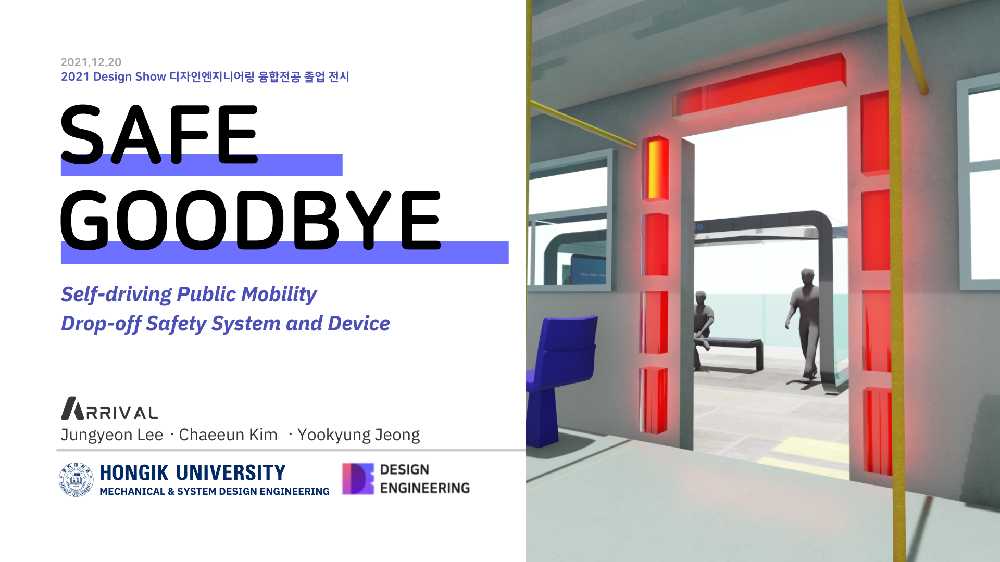
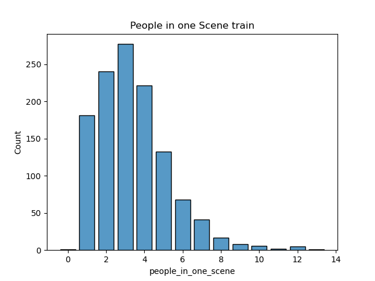
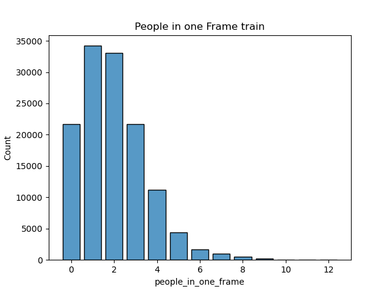
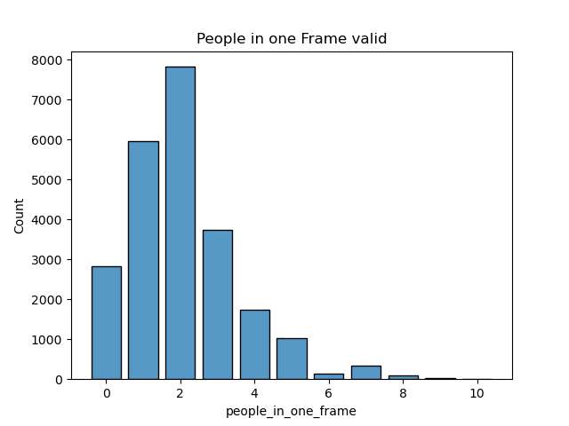
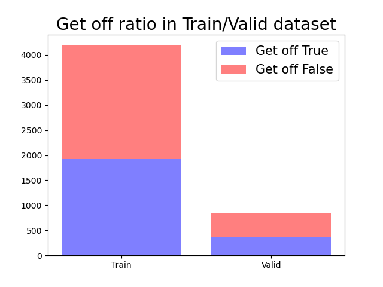
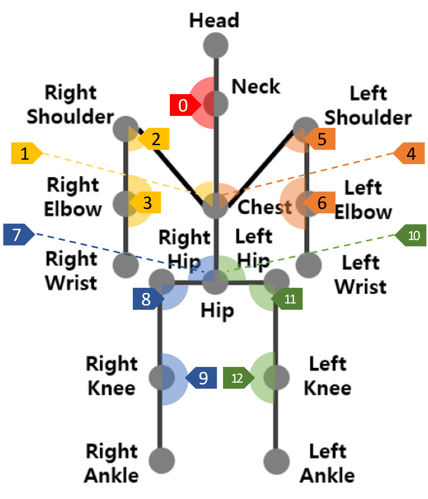
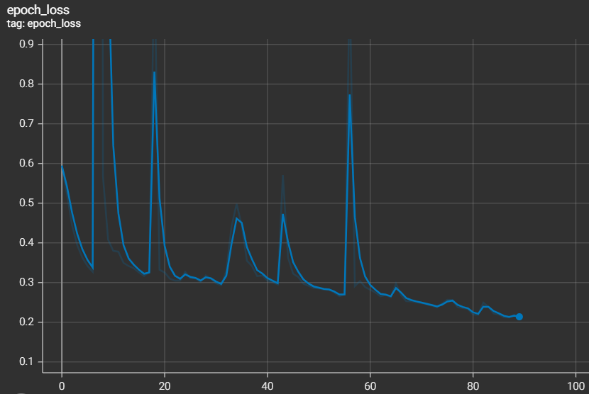
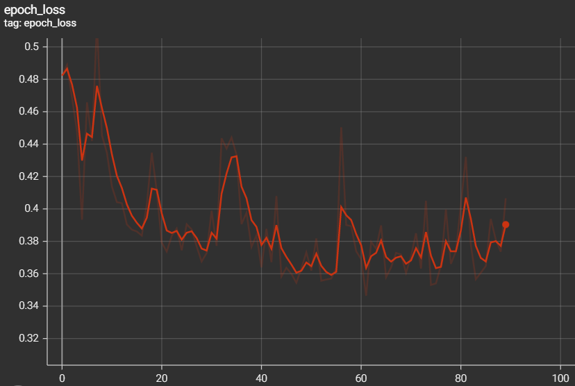
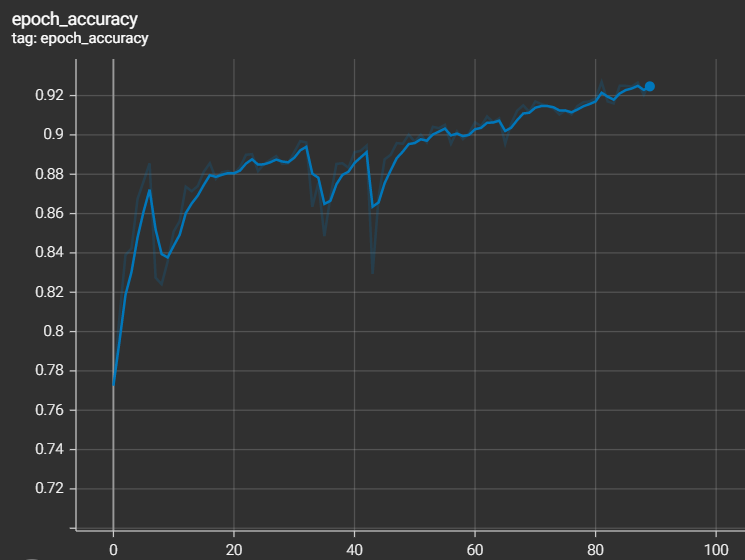

# Safe Goodbye
> TEAM: Arrival(Jungyeon Lee/Chaeeun Kim/Yookyung Jeong)

<a href="http://www.youtube.com/watch?feature=player_embedded&v=q2jDdYABbmg" target="_blank">
 
</a>

## Dataset
### [자율주행 - 버스 승객 승하차 영상](https://aihub.or.kr/aidata/34166) : Camera C (General C)
- Removed List
```
>>> image problem
...\ele\[ele]attend_270C
...\etc\[etc]attend_154C
...\hospital\[hospital]attend_392C
...\hospital\[hospital]leave_251C
>>> label problem
...\apt\[apt]attend_1275C
...\apt\[apt]attend_941C
```
- Target(demonstration result) from Validation set

```
reselecting

type 1
[hospital]attend_067C

type 2
[mid_high]leave_354C

```
<p align= "center">
  
</p>

||Train|Valid|
|-|-|-|
|per Scene|||
|per Frame|||


<p align= "center">
  
</p>

## Modeling
- 하차 전 약 35프레임에서의 각 사람의 skeleton data를 time series data로 만들어서 하차할 것인지 하차하지 않을 것인지 Intention Prediction

<p align= "center">
  
</p>

||Train|Valid|
|-|-|-|
|Loss|||
|Accuracy|||


## Codes
- `data_analysis.py`: 1
- `make_dataset.py`: 2
- `dataset.py`: 3
- `simple_dataset_keras.py`: 4 simple lstm model로 training
- `train.py`: 5
- `generate_video.py`: 6
- `tf2_multipose.py`: todo

## Reference
- [Scale invariant angle label](https://matplotlib.org/stable/gallery/text_labels_and_annotations/angle_annotation.html#sphx-glr-gallery-text-labels-and-annotations-angle-annotation-py)
- [seaborn.histplot](https://seaborn.pydata.org/generated/seaborn.histplot.html)
- [matplotlib barplot](https://rfriend.tistory.com/411)
- [AngleAnnotation class](https://matplotlib.org/stable/gallery/text_labels_and_annotations/angle_annotation.html#sphx-glr-gallery-text-labels-and-annotations-angle-annotation-py)
- [dealing with csv file](https://timetobye.github.io/csv_file_handler/)
- [Keras data generator](https://stanford.edu/~shervine/blog/keras-how-to-generate-data-on-the-fly)
- [Guide to the Functional API](https://keras.io/ko/getting-started/functional-api-guide/)
- [DataGenerator](https://chancoding.tistory.com/93)
- [Tensorflow Keras - 4 (자연어처리,감정분석)](https://datacook.tistory.com/53)
- [Tensorborad](https://www.tensorflow.org/tensorboard/get_started)
- [Checkpoint](https://keras.io/api/callbacks/model_checkpoint/)
- [ModelCheckpoint](https://deep-deep-deep.tistory.com/53)

### Baseline
- [Unified Framework for Pedestrian Detection & Intention Classification](https://github.com/mjpramirez/Volvo-DataX)
- [FuSSI-Net: Fusion of Spatio-temporal Skeletons for Intention Prediction Network](https://matthew29tang.github.io/pid-model/#/)s

### OD+Tracking
- [Yolov5 + Deep Sort with PyTorch](https://github.com/mikel-brostrom/Yolov5_DeepSort_Pytorch)
    - `python track.py --source [village]day_001B.mp4 --yolo_weights yolov5/weights/crowdhuman_yolov5m.pt --classes 0 --save-txt --save-vid`
    - `frame_idx, id, bbox_left, bbox_top, bbox_w, bbox_h, -1, -1, -1, -1)`
- [YOLOv4-Cloud-Tutorial](https://github.com/theAIGuysCode/YOLOv4-Cloud-Tutorial)

### Pose Estimation
- [Deep High-Resolution Representation Learning for Human Pose Estimation (CVPR 2019)](https://github.com/leoxiaobin/deep-high-resolution-net.pytorch)
- [Multi Person PoseEstimation By PyTorch](https://github.com/tensorboy/pytorch_Realtime_Multi-Person_Pose_Estimation)
    - `python Demo_video.py -backbone {CMU or Mobilenet} -video {video path} -scale {scale to image} -show {}`

### ETC
- [2021 인공지능 데이터 기반 서비스 공모전(09.15~10.08)](http://aihub-competition.or.kr/aidea)
